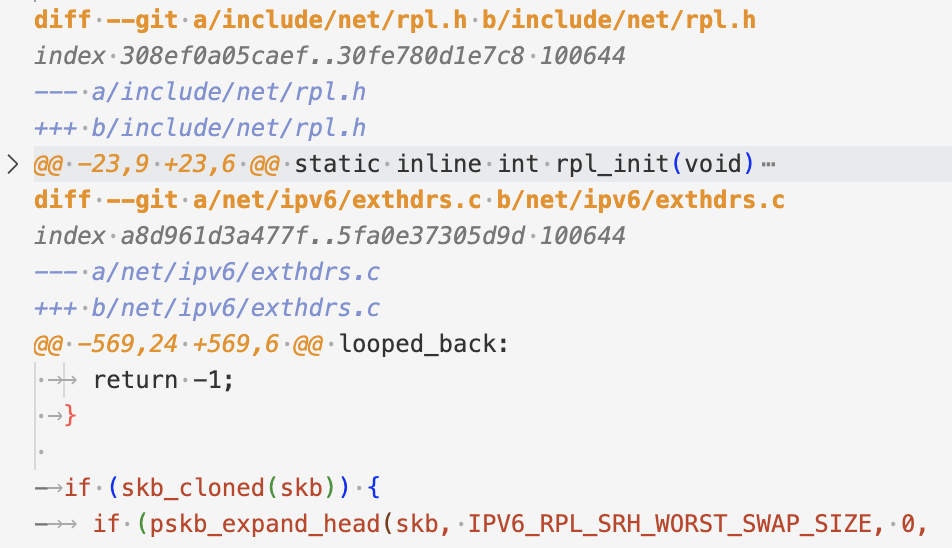
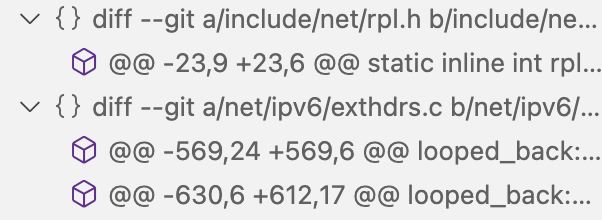
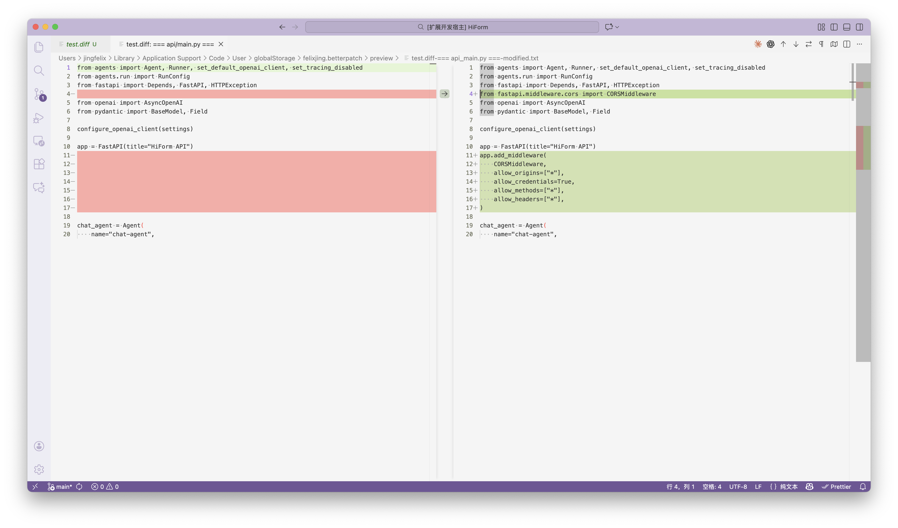

# BetterPatch

BetterPatch is a Visual Studio Code extension designed to enhance the display of diff format files.

## Features

1. **Diff-Hunk-level Folding**: betterpatch allows each Diff and Hunk in a diff file to be folded, making it easier for you to view and manage diff files.

2. **Diff-Hunk-level Outlining**: betterpatch also adds an outline for each Diff and Hunk, allowing you to quickly locate the Hunk you want to view in the outline view.

3. **One-click Preview**: open `.diff` or `.patch` files and use the toolbar button to view them with VS Code's native diff viewer.

## Screenshots

Folding:

> Note that highlighting is supported by [vscode-diff-lang-colorizer](https://github.com/baincd/vscode-diff-lang-colorizer).

Outline:

Preview:

## Known Issues

~~Outlining should be built from different levels of patches, but currently, it is built from the hunk level. This will be improved in the future.~~

## Release Notes

### 0.0.1

Initial release of BetterPatch

### 0.0.2

Add diff-level outlining

Add diff-level folding

### 0.0.3

Change the symbol of diff-level outlining

Add vscode-diff-lang-colorizer as a dependency

### 0.0.4

Add editor toolbar preview that renders a patch using VS Code's diff view
